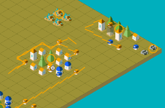

# Lux AI Challenge
https://www.kaggle.com/c/lux-ai-2021/

# About
Rules based bot for Lux AI simulation competition. Struggled to keep it in top 200 before abandoning. Final leader board position - 431 .

**Features of note**

[A* pathfinding](https://github.com/Conchobhar/lux-ai/blob/main/luxbot/lux/game_map.py#L391)



[Flood fill for grouping resource cells](https://github.com/Conchobhar/lux-ai/blob/main/luxbot/lux/game_map.py#L328)

# Structure 
`luxbot` - Actively developed bot - designate this as a source root in PyCharm (or otherwise modify the python path)

`bots` - Space for persisting luxbot versions

`utils` -  Code used by scripts

`replays_active` - Stores the last replay saved. Drag this into a browser to view

`create-bot.py` - Persist current version of `luxbot` to the `bots` folder and package as a submission.tar.gz :
```bash
$ python ./create-bot.py version_id
```

`run-game.py` -  Run bots against each other. Configuration done in script

`replay-game.py` - Replay a previous game from its json. Configuration done in script

*Note:* Paths defined in `utils/base.py` may need configured to the users' environment.

# Debugging hotfix
The agent (live or in a replay) should halt at set breakpoints. However
`kaggle_environments/agent.py` will play an agent under the following IO redirect context and try/except block:
```python
with StringIO() as out_buffer, StringIO() as err_buffer, redirect_stdout(out_buffer), redirect_stderr(err_buffer):
    try:
        start = perf_counter()
        action = self.agent(*args)
    except Exception as e:
        traceback.print_exc(file=err_buffer)
        action = e
    ...
```
Which will also redirect for example the output from PyCharms debug console. For the purpose of local debugging you can 
disable the redirect and exception catch with this edit in the source module file:
```python
with StringIO() as out_buffer, StringIO() as err_buffer: #, redirect_stdout(out_buffer), redirect_stderr(err_buffer):
    # try:
    start = perf_counter()
    action = self.agent(*args)
    # except Exception as e:
    #     traceback.print_exc(file=err_buffer)
    #     action = e
    # Allow up to 1k log characters per step which is ~1MB per 600 step episode
```
